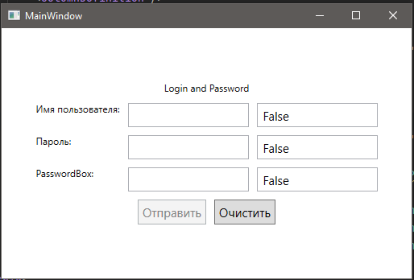

# WPF_LoginPassword
Создать приложение для ввода логина и пароля

Что должно быть?
- поле для ввода логина
- поле для ввода пароля
- кнопка отправки данных
- кнопка очистки

Кнопка отправки данных должна становиться активной только тогда, когда в двух полях будет хоть что-то введено.

Предусмотреть стили для элементов.

